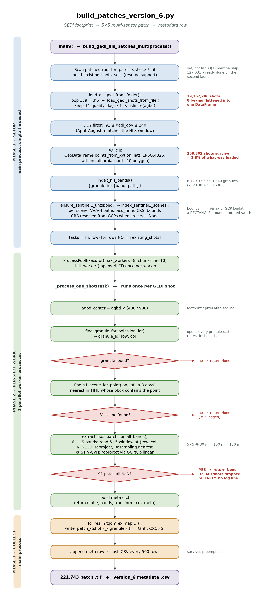

# What the script does

It turns **GEDI laser footprints** into **training examples**. For every usable GEDI
shot it writes one small GeoTIFF holding a 5×5 pixel stack of satellite imagery centred
on that shot, plus one row in a metadata CSV recording the biomass label and where the
data came from.

Input: 139 GEDI `.h5` granules, 6,720 HLS band files, 205 Sentinel-1 scenes, one NLCD
raster, one ROI polygon.

Output: **221,743 patch GeoTIFFs** and one metadata CSV.

\newpage

# Flowchart



\newpage

# Phase 1 — Setup (main process, single-threaded)

Runs once. Nothing here reads pixel data; it builds the work list.

| # | Function | What happens | Result |
|---|---|---|---|
| 1 | inline | Scan `patches_root` for `patch_<shot>_*.tif`, extract the shot number with regex `patch_(\d+)_`, collect into `existing_shots` | Resume support. A **set**, not a list, so `in` is O(1). 127,031 found on the second launch |
| 2 | `load_all_gedi_from_folder` | Loop 139 `.h5` files, call `load_gedi_shots_from_file` on each, `pd.concat` the results | 19,162,286 shots. The 8 beams are flattened into one flat table |
| 3 | inline | DOY filter `91 ≤ gedi_doy ≤ 240` | Restricts to April–August so GEDI and HLS describe the same season |
| 4 | inline | Build a GeoDataFrame of Points from lon/lat, `.within()` the ROI polygon | **258,302 shots** = 1.3% of what was loaded. GEDI granules follow orbit tracks, not your polygon |
| 5 | `index_hls_bands` | Parse filenames into `{granule_id: {band_code: path}}` | 6,720 `.tif` files collapse to **840 granules** (252 Landsat L30 + 588 Sentinel-2 S30) |
| 6 | `index_sentinel1_scenes` | Unzip any `.SAFE` still archived, then record VV/VH paths, acquisition time, CRS and bounds per scene | CRS comes from GCPs when `src.crs` is `None`, which is the normal case for these GRD-HD products |
| 7 | inline | Build `tasks`, skipping shots already in `existing_shots` | The work list handed to the pool |

## The quality filter

Inside `load_gedi_shots_from_file`, only two conditions are applied:

```python
mask = (quality >= min_quality) & np.isfinite(agbd)
```

Note that GEDI marks missing biomass with **−9999**, not NaN, and `np.isfinite(-9999)`
is `True`. So the second condition removes zero rows — the quality flag alone is keeping
fill values out.

\newpage

# Phase 2 — Per-shot work (8 parallel worker processes)

`ProcessPoolExecutor(max_workers=8, chunksize=10)` with a `spawn` context.
`_init_worker` opens the NLCD raster once per worker rather than once per shot.

`_process_one_shot` then runs for each GEDI shot:

| # | Step | Detail |
|---|---|---|
| 1 | Scale the label | `agbd_center = agbd × (400 / 900)` — the footprint-to-pixel area fraction |
| 2 | `find_granule_for_point` | Opens each granule's reference raster and tests whether the point falls inside its bounds. Returns `granule_id, row, col` |
| 3 | `parse_hls_datetime` | Reads the acquisition time out of the granule ID (`2021213T190305` = year 2021, day 213) |
| 4 | `find_s1_scene_for_point` | Among scenes whose **bounding box** contains the point and whose acquisition is within 3 days, take the one nearest in time |
| 5 | `extract_5x5_patch_for_all_bands` | Builds the image stack — see below |
| 6 | Build `meta` | Label, coordinates, granule ID, S1 scene name, day gap |

## Building the 5×5 stack

Band order depends on which sensor produced the granule:

- **S30** (Sentinel-2): `B02, B03, B04, B8A, B11, B12, EVI, NDVI`
- **L30** (Landsat): `B02, B03, B04, B05, B06, B07, EVI, NDVI`

then `NLCD`, then `S1_VV`, `S1_VH` — 11 bands, each 5×5. At 30 m resolution a 5×5
window covers **150 m × 150 m**.

Each source is handled differently, and the resampling choice matters:

| Source | Method | Why |
|---|---|---|
| HLS bands | direct window read | Already on the target grid |
| NLCD | `Resampling.nearest` | Categorical land cover codes. Bilinear would average class 42 and class 82 into 62, which is not a class |
| Sentinel-1 | `Resampling.bilinear`, reprojected through GCPs | Continuous backscatter, and the product carries no affine transform |

## Where shots are dropped

Six places return `None`, discarding the shot. Only one of them logs anything.

| Condition | Logged? |
|---|---|
| No HLS granule contains the point | no |
| A required band is missing from the granule | no |
| The point sits within 2 pixels of the raster edge | no |
| No Sentinel-1 scene within 3 days | **yes** — 395 times |
| The reprojected S1 window is entirely NaN | no — **32,340 times** |
| Any exception | yes |

The fifth row is the significant one. Because scene selection tests a **rectangular
bounding box** around a **rotated** Sentinel-1 swath, points in the empty corners
"find" a scene, the reprojection returns 25 NaNs, and the whole sample is discarded —
including the perfectly good optical data already extracted.

\newpage

# Phase 3 — Collect (main process)

Results stream back through `ex.map` and are consumed in the main process:

1. Write the cube to `patch_<shot_number>_<granule_id>.tif` as a multi-band GeoTIFF
2. Append `patch_tifs` and `bands` to the metadata row
3. Every 500 rows, append to the CSV and clear the buffer

The incremental flush matters on a preemptible queue: a job killed at hour 20 keeps
everything written so far, and the next launch resumes from `existing_shots`.

# The funnel

| Stage | Count |
|---|---|
| Shots loaded from 139 granules | 19,162,286 |
| After DOY and ROI filters | 258,302 |
| Patches successfully written | **221,743** |
| Lost during patch extraction | 36,559 (14.2%) |

For comparison, version_5 lost only 3,824 (1.5%) from the same 258,302 candidates.
The extra 32,735 is the cost of requiring Sentinel-1, and it is not evenly distributed:
the lost shots average **26.8 Mg/ha** against **70.9** for those kept, because coastal
areas have dense overlapping radar coverage while the dry interior sits near swath edges.

# Output format

**Patch GeoTIFF** — 11 bands × 5 × 5, float32, georeferenced to the HLS grid.

**Metadata CSV** — one row per patch:

`gedi_file, shot_number, lat, lon, agbd_raw, agbd_center, agbd_log, center_frac,
hls_granule, row, col, sentinel1_scene, sentinel1_time, sentinel1_days_diff,
patch_tifs, bands`

The `bands` column is what lets the training Dataset map a variable-length band list
into fixed channel slots, which is how L30 and S30 granules coexist in one dataset.
